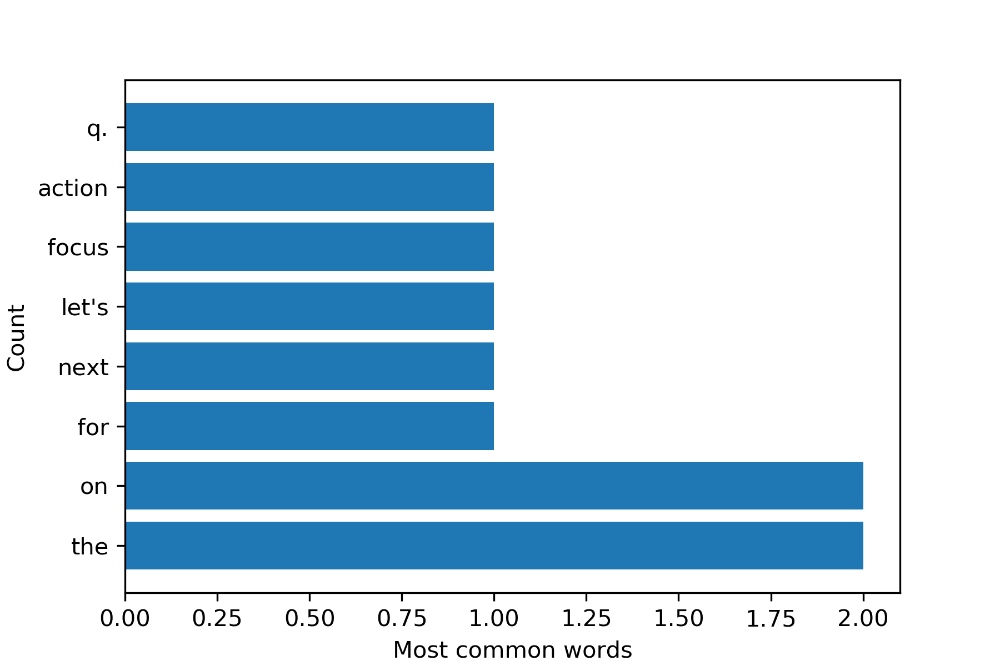

CS50P Final Project
# File reader, word count 
#### Video Demo:   

#### Description
The program takes as input a text file, via a mandatory command line argument and outputs a bar plot of the 'RANGE' most common words.

This is achieved by a sequence of operations defined in specific functions.
The main functionality of the program is encoded in the main project.py file.
There is a test file 'test_project.py', as well as a sample test file 'test.txt' to run the tests.
Additionally, the file 'constants.py' contains, parameters such as default file names and the range of words to keep from the dataset.

The main steps in the program are:

**Reading the file**\
performed by the functions:\
*check_file* and *read_file*\
The first is only responsible for opening the file. The second function reads the lines in the file, separates them into individual words and saves them in a dictionary, composed of key-value pairs, where the keys are the different words and the coresponding values count the appearance of that given word in the text.\

**Cleaning the input**\
While reading the file, the function *word_cleaner* is called. This has the purpose of removing spaces, punctuation and other spurious characters from each word. It returns a lowercase stripped down version of each word.
The list of punctuation marks to be removed is defined in the global variable PUNCTUATION in the 'constants.py' file.

Examples of word clieaning is:\
word_cleaner("Hello,") = "hello"\
word_cleaner("world!") = "world"

At this stage we have a dictionary of the form\
{word1: 10, word2: 15, word3: 20\}

**Preparing the data**\
The dictionary is then passed to the *dict_to_data* function to be converted into a pandas DataFrame.\
Here, the dataset is sorted in descending order and then the top 'RANGE' values are kept and returned as a stripped down DataFrame.

**Observing the data**\
Once we have the set of data we want to observe, the data is processed and can be printed on screen,with the *print_table* function. This function prints the data on the terminal window with the use of the tabulate package.\
We can then process the data with the *create_plot* function. This defines a matplotlib figure and creates a horizontal bar plot of the data.

The plot is saved as the 'plot.png' file in the working directoy.
The filename is defined in the 'constants.py' configuration file.

## To implement
- refine the word_cleaner function to make it work nicely with code, scripts, etc..\
For instance, we can run the script on a LaTeX file. In thjis case, we would want to remove all lines starting with a backslash or a comment character.

- before restricting the data to the most common RANGE words, we can run some statiscs on the entire data set.\
- We could also easily extend this to a collection of m,ultiple text files.\
- A useful additinoal step would be to remove articles, prepositions, pronouns or, more in general, the top X most common words in English, to reduce to the set of words that are most significant for the file we are working on.

### List of functions
check_file\
read_file\
word_cleaner\
duct_to_data\
print_table\
create_plot\

### Requirements
Also listed in the 'requirements.txt' file:\
argoarse\
numpy\
pandas\
tabulate\
matplotlib

